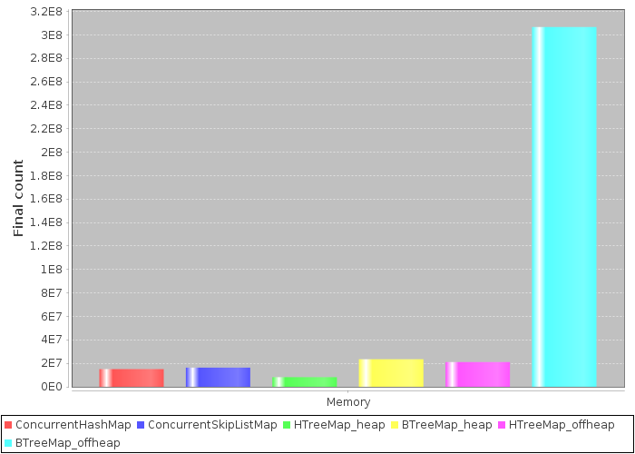
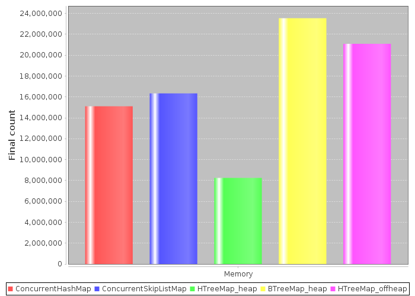
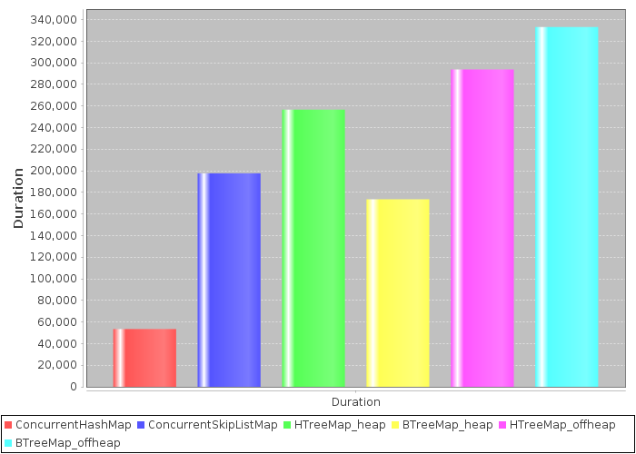

In-memory benchmarks
======================

MapDB provides more advanced alternative to Java Collections.
This benchmarks compares various `Map` implementations.
Its purpose is to show MapDB as reasonable alternative to Java Collections for some cases.

MapDB supports many features, uses less space and does serialization.
Despite that it has performance comparable to Java Collections; sometimes it is faster,
sometimes it is "only" 10 times slower. Also current MapDB 2.0 release is not fastest,
it is initial naive implementation, we plan performance optimisations in 2.1 release.

This benchmarks tries to be objective.
It is used for performance regression testing and MapDB development depends on its precision.
Java Collections suffer greatly from Garbage Collection overhead, we made sure this is not a case here.
MapDB maps scale to terabytes without a hiccup.
It would be easy to show MapDB as much faster, by increasing Map size.

Benchmark source is in `Github repo <https://github.com/jankotek/mapdb-benchmarks>`_.
Please send Pull Request if you have improvements.
All tests ran on 64bit JDK8.

Maps
~~~~~~~~~~~~~~

There are six maps in test. All tests work on Map with 100 million entries, ``Long`` key and ``UUID`` value.

``ConcurrentHashMap`` is regular concurrent ``HashMap`` bundled with Java.

``ConcurrentSkipListMap`` is concurrent version of ``java.util.TreeMap`` bundled with Java.

``HTreeMap`` is concurrent ``HashMap`` implementation from MapDB. It is optimized for bigger keys and large number of entries.
It has some nice features such as entry expiration with TTL or maximal size.

``BTreeMap`` is concurrent ``TreeMap`` implementation from MapDB. It is optimized for minimal space usage and for small keys.
It has specialized keys (for example ``Long`` key is stored as primitive ``long``) and other nice features.

MapDB works in two modes. ``heap`` mode does not use serialization. Everything is stored on heap, as object instances.
Heap mode is affected by Garbage Collector. This mode is usually faster for smaller sets.

``offheap`` mode serializes all data into in-memory binary store. It is not affected by Garbage Collector.
It is better for large maps, it runs just fine with 500GB store size.

Memory usage
~~~~~~~~~~~~~~

This graph show how much entries Map can fit into 1GB of heap memory.
JVM starts with 1GB maximal heap size (`-Xmx1G`).
Entries are added into `Map<Long,UUID>` until JVM terminates with `OutOfMemoryException`.
Key is 8-byte`java.util.Long` number, value is 16-byte `java.util.UUID` number
Small objects were chosen to better illustrate space overhead of internal Map structures (nodes, hash table..)

.. centered:: **Number of entries inserted into Map with 1GB heap, before JVM runs out of memory (higher is better)**

Offheap BTreeMap has very impressive result thanks to Key Delta Compression. It serializes key array by only storing
differences between neighbour keys. There is no trick here, just lot of optimizations.
Delta Compression have almost zero overhead and Map is modifiable with reasonable performance.
Also similar technique is here for Strings, Arrays...
We could save another 20% of space by using read-only Archive storage.

.. centered:: **The same graph, but without BTreeMap_offheap**

This chart has BTreeMap_offheap removed to better illustrate difference between remaining five collections.

``HTreeMap_heap`` is not so good thanks to its expandable hash table. In decompressed heap form it takes lot of space.
But in compacted form ``HTreeMap_offheap`` take a lot less space.

``BTreeMap_heap`` is bit more space efficient compared to Java Collections.
It stores keys in primitive form (``long`` versus ``Long``) and that requires less pointers.

Random updates
~~~~~~~~~~~~~~~~~

.. centered:: **Time to update 100M random keys on Map with 100M entries (smaller is better)**

``ConcurrentHashMap`` in this case rocks.

``BTreeMap_heap`` takes advantage of its specialized keys. Binary search in primitive form is more efficient
and there is no surprise it outperforms ``ConcurrentSkipListMap``.

Another surprise is reasonable performance of both offheap collections.
They are doing (de)serialization on top of everything and it shows how optimized MapDB code is.

Random gets
~~~~~~~~~~~~~~~~~

.. centered:: **Time to get 100M random keys on Map with 100M entries (smaller is better)**
.. image:: res/InMemoryGet.png

``ConcurrentHashMap`` rocks again.

``ConcurrentSkipListMap`` seems bit slower compared to MapDB heap collections. SkipList is not CPU cache friendly.

Another surprise is reasonable performance of both offheap collections.
They are doing deserialization on top of everything and it shows how optimized MapDB code is.

