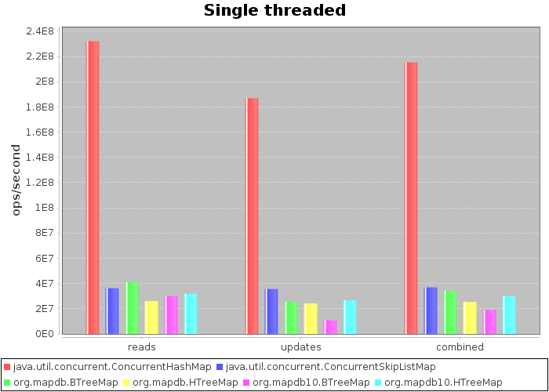
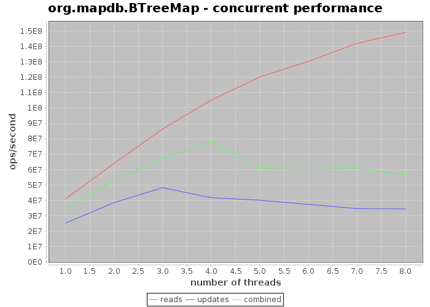
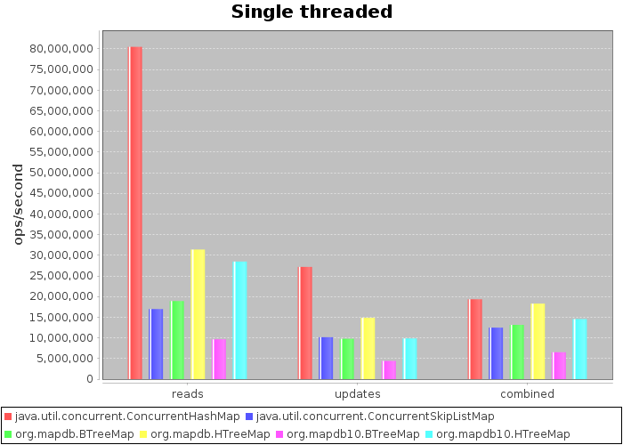

Benchmarks
==========

Goal for MapDB is to have speed comparable to ``java.util.concurrent`` collections such ``ConcurrentSkipListMap``.
MapDB does things like serialization on background, so it is not always possible, but its very close.

This benchmark compares various ``Map`` implementations. Benchmark sources are available in
`Github repo <https://github.com/jankotek/mapdb-benchmarks>`_.

Long - UUID map
~~~~~~~~~~~~~~~~

First benchmark tests ``Map<Long,UUID>`` map. It chooses small entry size (24 bytes), since its size affect performance.

TODO metrics

``ConcurrentHashMap`` is about 8x faster than MapDB. Map size is 10 million items,
so there is practically zero GC overhead. With larger sizes ``ConcurrentHashMap``
performance degrades due to GC overhead and MapDB will eventually become faster.

Also MapDB uses compression, so it consumes much less memory.

TODO chart of size scalability

TODO chart of memory usage depending on collection size

Chart bellow shows performance of ``BTreeMap`` from MapDB with number of threads on quad core CPU with 8 virtual cores.

And this is multi-threaded performance for ``HTreeMap`` (HashMap). There is bug in segment hashing,
so it wont scale over 2 threads.

.. image:: img/charts/org_mapdb_benchmarks_InMemoryLongTest-org_mapdb_HTreeMap-scalability.png

Long - UUID map
~~~~~~~~~~~~~~~~

Second benchmark tests ``Map<String,String>`` with key and value size 32 bytes.
This is unfortunate situation for MapDB since deserialization overhead is high.

MapDB 2.0 was all about optimizing deserialization costs and it pays of.
Please notice performance difference between MapDB 1.0 and 2.0 collections.

Also ``HTreeMap`` is surprisingly fast compared to ``ConcurrentHashMap``.
String hashing probably adds fixed overhead.

And here is multi-threaded performance with String keys and values

.. image:: img/charts/org_mapdb_benchmarks_InMemoryStringTest-org_mapdb_BTreeMap-scalability.png

.. image:: img/charts/org_mapdb_benchmarks_InMemoryStringTest-org_mapdb_HTreeMap-scalability.png

TODO BTreeMap external values

TODO BTreeMap node size

On Disk
~~~~~~~

TODO: On disk benchmarks Will be added soon...
